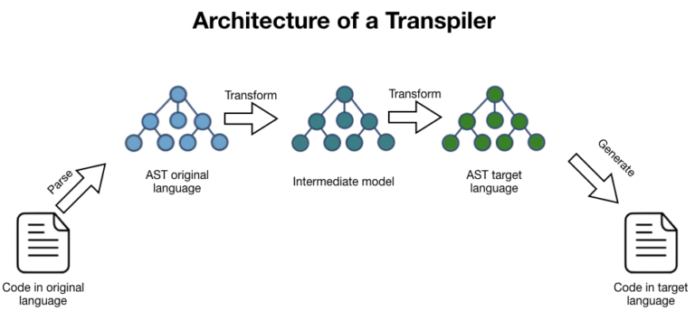

# Flutter-like to HTML/JS Transpiler

## Project Overview

This project is an experimental transpiler that translates "Flutter-like" code into HTML and JavaScript. It was developed as a university assignment to demonstrate the process of building a transpiler, including lexical analysis, parsing, syntax and semantic error handling, Abstract Syntax Tree (AST) construction, and code generation.

The main goal of this project is to allow users to write code in a Flutter-like syntax and have it automatically translated into web technologies (HTML & JS). This showcases the ability to work with compiler design concepts and implement complex language processing systems.

## Features

- Custom lexer for tokenizing Flutter-like syntax
- Parser with comprehensive syntax and semantic error handling
- Multi-scoped symbol table implementation using a stack of hashmaps
- Abstract Syntax Tree (AST) generation
- Code generation from AST to HTML and JavaScript
- Visual representation of the AST using jGraphT library

## Project Structure

The project is structured using the Composite Design Pattern, which is ideal for representing the parent-child relationships in the language structure. The main components are:

1. Program: The root of the structure, containing statements and the main scaffold.
2. Widgets: Both pre-defined and custom UI elements.
3. Statements: Variable declarations, assignments, and custom widget definitions.
4. Properties: Attributes and settings for widgets.
5. Expressions: Mathematical and logical expressions.

## Implementation Details

### Transpiler Process
1. **Lexical Analysis**: Tokenizes the input code and checks for syntactic errors.
2. **Parsing and Semantic Analysis**: Matches token sequences against parsing rules and performs semantic checks (e.g., undefined variables, duplicate names, nested scopes).
3. **Abstract Syntax Tree (AST) Generation**: Builds an AST representing the essential structure of the code.
4. **Code Generation**: Converts the AST into the target languages (HTML and JavaScript).

### Design Patterns Used
- **Composite Design Pattern**: Used to structure the project, representing the parent-child relationships in the language elements.
- **Visitor Design Pattern**: Employed to separate the logic applied to the parsing tree (for AST generation and syntactic error checking) and the AST (for code generation and other operations) from the structure itself.

### Technologies and Tools
- ANTLR4: Used for lexer and parser generation
- Java: Primary programming language
- jGraphT library: Utilized for visualizing the AST as a graph

## How to Use

[To be added in a future update]

## Future Improvements

The project's structure, thanks to the use of Composite and Visitor design patterns, allows for easy extensibility and improvements without affecting the existing codebase. Potential areas for enhancement include:

- Expanding the set of supported Flutter-like widgets and properties
- Optimizing the generated HTML and JavaScript code
- Adding support for more complex Flutter features
- Implementing a user-friendly interface for the transpiler

## Contributors

This project was developed as a university assignment by the following team members:

- [Alaa Aldeen Zamel](https://github.com/alaazamelDev)
- Mhd Hadi Barakat
- Anas Rish
- Anas Durra
- Sham Tuameh

We appreciate the hard work and dedication of all team members in bringing this project to fruition.

## License

This project is licensed under the MIT License - see the [LICENSE](LICENSE) file for details.
